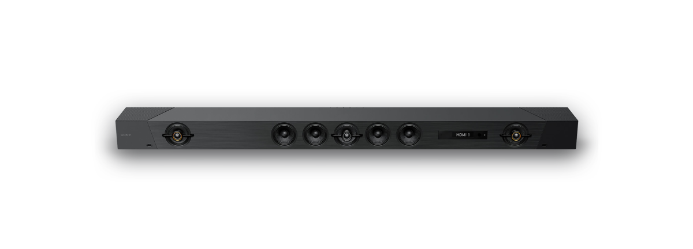
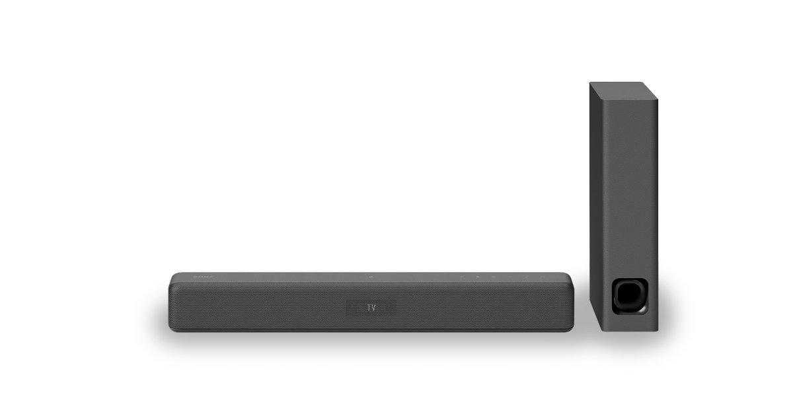
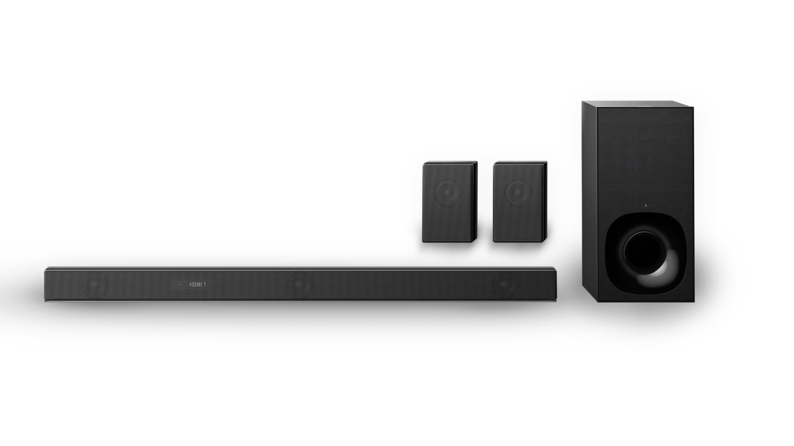
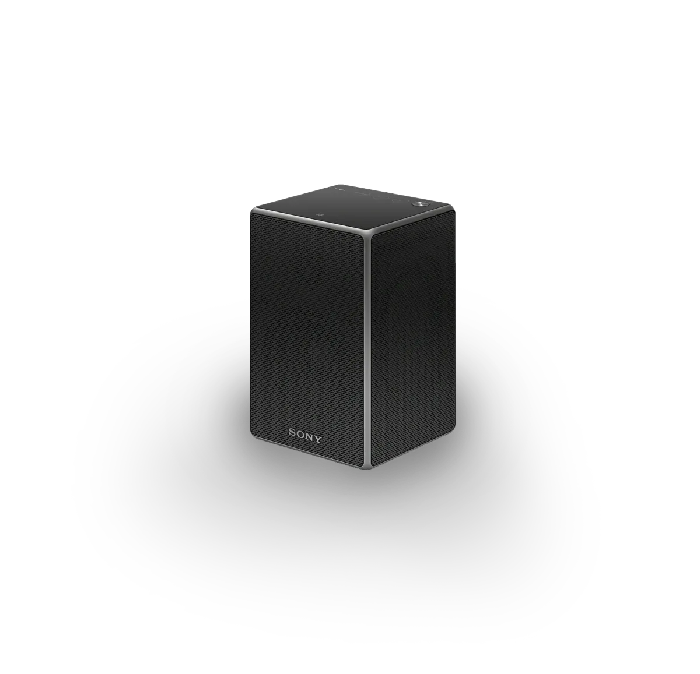
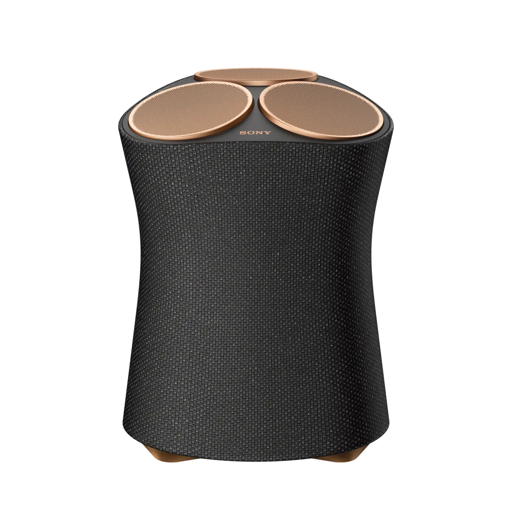
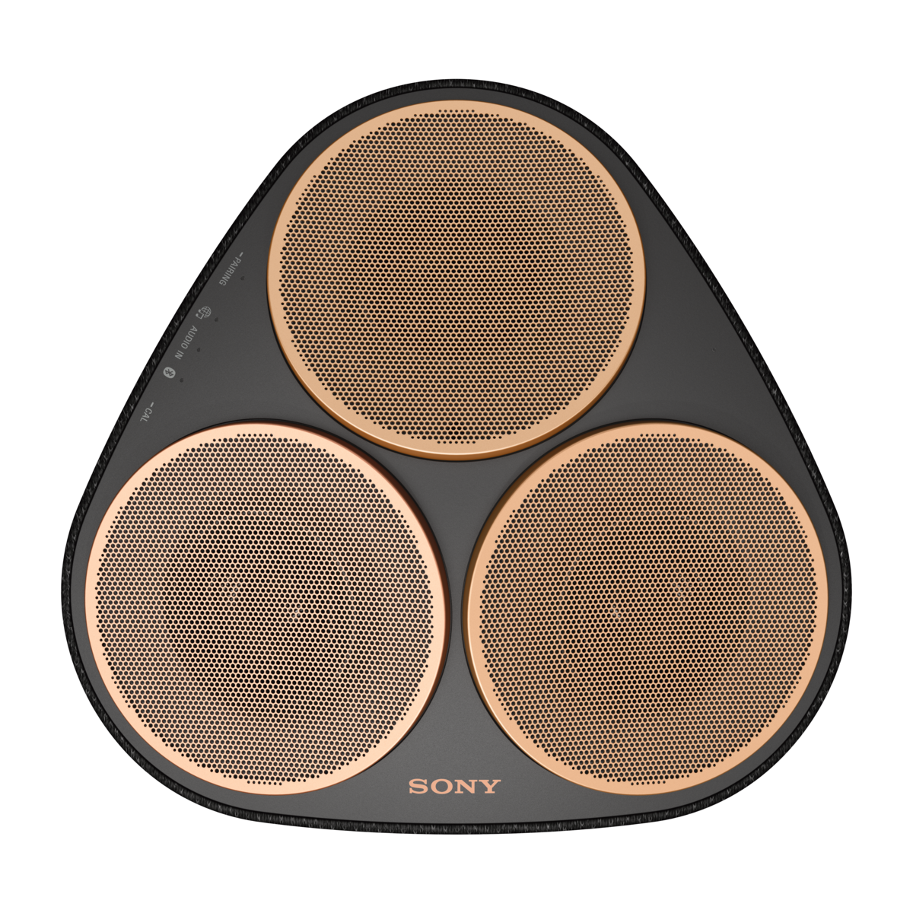
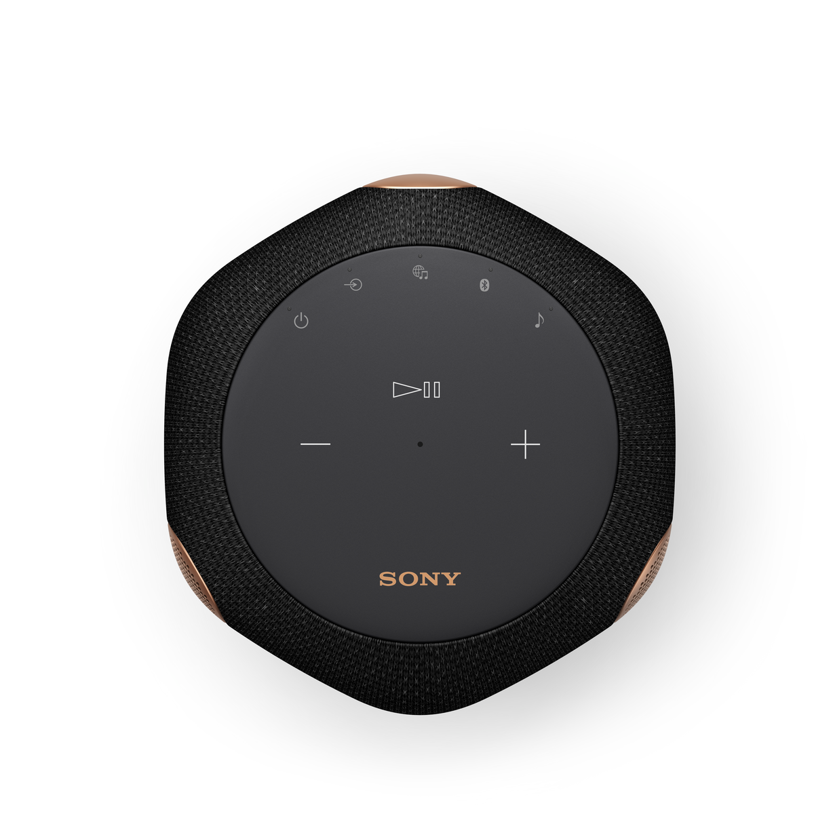

<p align="center">


</p>


# Homebridge Sony Audio Plugin
[](https://github.com/homebridge/homebridge/wiki/Verified-Plugins)

This is a Homebridge platform plugin allow control the power, volume and input source on a supported Sony audio products.

## Features you can control with Sony Audio Plugin
* power – turn on and off
* volume – control sound levels including mute via iOS Remote
* input source – identify sound inputs
* control arrows, select, back and information buttons via iOS Remote


For multi-zone environments plugin control current active output zone.

## Which Sony devices support the Audio Control API?
The following Sony audio products are accessible via the Homebridge Sony Audio Plugin.

### STR-DN1080


> 7.2 channel home theater AV receiver

### HT-ST5000


> 7.1.2 channel Dolby Atmos/DTS:X soundbar with Wi-Fi/Bluetooth technology

### HT-MT500


> 2.1 channel compact soundbar with Wi-Fi/Bluetooth technology

### HT-Z9F/HT-ZF9


> 3.1 channel Dolby Atmos/DTS:X soundbar with Wi-Fi/Bluetooth technology

### HT-CT800


> 2.1 channel soundbar with Wi-Fi/Bluetooth technology

### SRS-ZR5


> Portable Wireless Bluetooth/Wi-Fi speaker

### SRS-RA5000
<p float="left">
  
  
</p>

> Premium Wireless Speaker with Ambient Room-filling Sound

### SRS-RA3000
<p float="left">
  
  
</p>

> Premium Wireless Speaker with Ambient Room-filling Sound

## Installation
If you are new to homebridge, please first read the homebridge [documentation](https://www.npmjs.com/package/homebridge).

### Install homebridge
```sh
npm install -g homebridge
```
### Install homebridge-sony-audio
```sh
npm install -g homebridge-sony-audio
```

## Configuration

No special configuration is required.\
Just add the `SonyAudio` platform to the platforms section:
```json
"platforms": [
  {
    "platform": "SonyAudio"
  }
]
```
## Adding devices

Devices are added automatically through the discovery process.

The discovery process to find products connected to your network, uses the Universal Plug and Play (UPnP) protocols and the Simple Service Discovery Protocol (SSDP). The audio product must be connected to the network and powered on, for the the discovery process to work.

For instructions, see the user manual for your product.

## Setting up
Finded devices will be publishing externally, so you need paired it seperately:
1. In Home.app select "Add Accessory"
2. Click "I Don't Have a code or Cannot Scan"
3. On the next screen you find the discovered devices
4. Tap one and enter the pin code from your homebridge instance.

