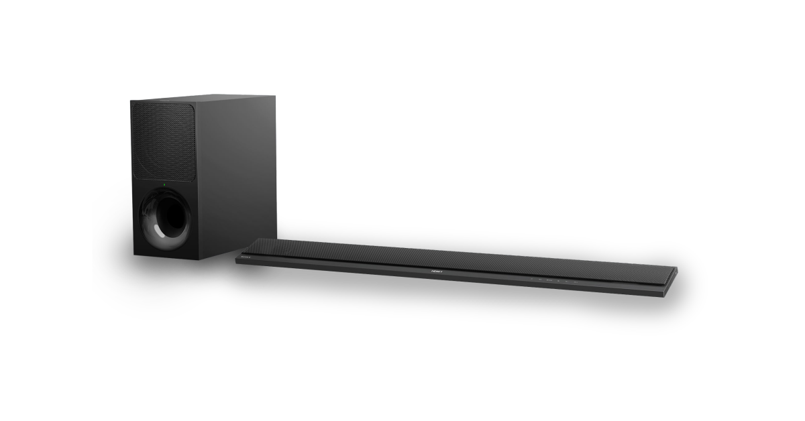
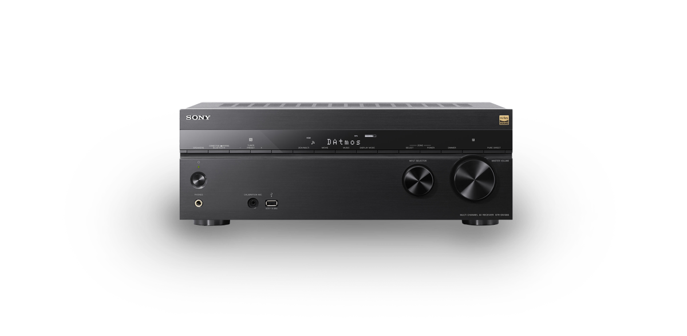
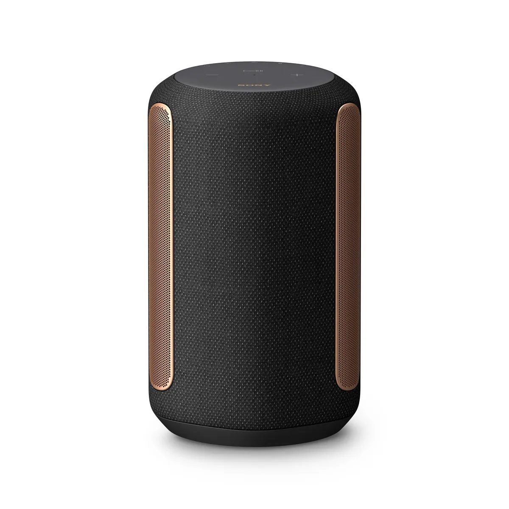

<p align="center">


</p>


# Homebridge Sony Audio Plugin
[](https://github.com/homebridge/homebridge/wiki/Verified-Plugins)

This is a Homebridge platform plugin allow control the power, volume and input source on a supported Sony audio products.

## Features you can control with Sony Audio Plugin
* power – turn on and off
* volume – control sound levels including mute via iOS Remote
* input source – identify sound inputs
* control arrows, select, back and information buttons via iOS Remote
* control of input names and their visibility


For multi-zone environments plugin control current active output zone.

## Which Sony devices support the Audio Control API?
The following Sony audio products are accessible via the Homebridge Sony Audio Plugin.

[**Soundbars**](#soundbars)



[**Receivers**](#receivers)



[**Speakers**](#speakers)

<p style="margin:auto;width:40%" >

</p>

### **Soundbars**

|Device|Description|More information|
|---|---|---|
|HT-A9|High Performance Home Theater System|<a href="https://electronics.sony.com/tv-video/tv-video-home-theater-sound-bars/soundbars/p/hta9">Product information|
|HT-A7000|7.1.2ch Dolby Atmos® Soundbar|<a href="https://electronics.sony.com/tv-video/tv-video-home-theater-sound-bars/soundbars/p/HT-A7000">Product information</a>|
|HT-A5000|5.1.2ch Dolby Atmos®/ DTS:X® Soundbar|<a href="https://www.sony.co.uk/electronics/sound-bars/ht-a5000">Product information</a>|
|HT-ST5000|7.1.2 channel Dolby Atmos/DTS:X soundbar with Wi-Fi/Bluetooth technology|<a href="https://www.sony.com/electronics/sound-bars/ht-st5000">Product information</a>|
|HT-MT500|2.1 channel compact soundbar with Wi-Fi/Bluetooth technology||
|HT-ZF9|3.1 channel Dolby Atmos/DTS:X soundbar with Wi-Fi/Bluetooth technology|<a href="https://www.sony.co.uk/electronics/sound-bars/ht-zf9">Product overview</a>|
|HT-Z9F|3.1 channel Dolby Atmos/DTS:X soundbar with Wi-Fi/Bluetooth technology|<a href="https://www.sony.com/electronics/sound-bars/ht-z9f">Product overview</a>|
|HT-CT800|2.1 channel soundbar with Wi-Fi/Bluetooth technology||
|HT-790 / HT-S40R\*|Home cinema system with Bluetooth/Wi-Fi technology||
  

### **Receivers**
|Device|Description|More information|
|---|---|---|
|STR-DN1080|7.2 channel home theater AV receiver|<a href="https://www.sony.co.uk/electronics/av-receivers/str-dn1080">Product information</a>|

### **Speakers**
|Device|Description|More information|
|---|---|---|
|DeviceSRS-RA5000|Premium Wireless Speaker with Ambient Room-filling Sound|<a href="https://www.sony.co.uk/electronics/wireless-speakers/srs-ra5000" target="_blank">Product information</a>|
|SRS-RA3000|Premium Wireless Speaker with Ambient Room-filling Sound|<a href="https://www.sony.co.uk/electronics/wireless-speakers/srs-ra3000" target="_blank">Product information</a>|
|SRS-ZR5|Portable Wireless Bluetooth/Wi-Fi speaker"|

\* Reported as working by users, not verified by the maintainers.
Any device that answers the Sony Audio Control API and reports the
`homeTheaterSystem` or `personalAudio` product category should work.

## Installation
If you are new to homebridge, please first read the homebridge [documentation](https://www.npmjs.com/package/homebridge).

### Requirements

|homebridge-sony-audio|Homebridge|Node.js|
|---|---|---|
|2.x|1.8.0 – 2.x|22, 24, 26|
|1.x|1.3.0 – 1.x|>= 14.21.3|

> **Upgrading to 2.0.0:** no configuration changes are required. Version 2 adds
> Homebridge 2.x support (HAP-NodeJS 2.x) and drops Node.js versions older than 22,
> in line with Homebridge 2.x requirements.

### Install homebridge
```sh
npm install -g homebridge
```
### Install homebridge-sony-audio
```sh
npm install -g homebridge-sony-audio
```

### Beta releases

Beta versions are published under the `beta` dist-tag and are **not** installed by default:
```sh
npm install -g homebridge-sony-audio@beta
```
They contain changes that could not be verified against real hardware, so feedback —
either a bug report or a simple "works for me" on the corresponding
[release](https://github.com/kovalev-sergey/homebridge-sony-audio/releases) or
[issue](https://github.com/kovalev-sergey/homebridge-sony-audio/issues) — is very welcome.
To go back to the stable release: `npm install -g homebridge-sony-audio@latest`.

## Configuration

No special configuration is required.\
Just add the `SonyAudio` platform to the platforms section:
```json
"platforms": [
  {
    "platform": "SonyAudio"
  }
]
```
## Adding devices

Devices are added automatically through the discovery process.

The discovery process to find products connected to your network, uses the Universal Plug and Play (UPnP) protocols and the Simple Service Discovery Protocol (SSDP). The audio product must be connected to the network and powered on, for the the discovery process to work.

For instructions, see the user manual for your product.

## Setting up
Finded devices will be publishing externally, so you need paired it seperately:
1. In Home.app select "Add Accessory"
2. Click "I Don't Have a code or Cannot Scan"
3. On the next screen you find the discovered devices
4. Tap one and enter the pin code from your homebridge instance.

## Troubleshooting

### "Adding new accessory" is logged on every Homebridge restart
This is expected. The accessory is a Television accessory, which HomeKit requires to be
published as an *external* accessory. Homebridge does not cache external accessories, so
the plugin re-creates and re-publishes it at every start. The accessory keeps its pairing
and its HomeKit settings, because its UUID is derived from the (stable) UDN of the device.

### The device disappeared from the Home app / I deleted it and cannot add it back
External accessories are paired separately from the Homebridge bridge, so after removing
the accessory in the Home app you have to add it again with the
[Setting up](#setting-up) steps above ("Add Accessory" → "I Don't Have a Code or Cannot
Scan" → pick the device → enter the PIN of your Homebridge instance). The accessory only
shows up there while Homebridge is running and the device has been discovered - check the
log for `Compatible device found, added: <name>` first. If the Home app still refuses to
add it, remove the accessory in the Home app once more and restart Homebridge.

### `Incompatible device found, skipped: <name>`
The device answered the discovery, but the plugin could not initialize it. Enable the
Homebridge debug log (`homebridge -D`) and restart: the debug output contains the reason
(unsupported product category, unsupported API version or an API error) plus the raw
requests and answers of the device. Please attach that debug output when reporting a
new device.

### The device is not discovered at all
Discovery relies on SSDP multicast, which does not cross subnets or VLANs. Homebridge and
the Sony device have to be in the same broadcast domain, and the Homebridge host must not
block UDP port 1900. Adding the device manually by IP address is not supported: the plugin
needs the UPnP device description that is only served through the discovery answer.

